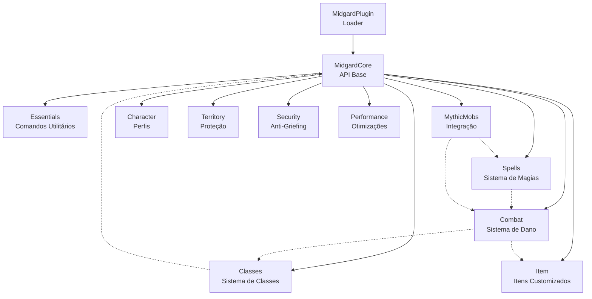
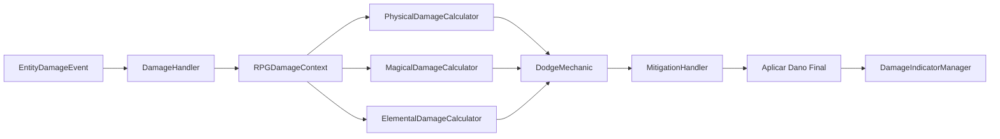

# Documentação Completa do MidgardRPG

## 1. Visão Geral do Projeto

### 1.1 Descrição
O **MidgardRPG** é um sistema RPG modular de larga escala para Minecraft (Spigot/Paper 1.21+), estruturado em três camadas principais:

- **midgard-core**: API base com gerenciadores compartilhados
- **midgard-loader**: Bootstrap que inicializa o sistema
- **midgard-modules**: Funcionalidades específicas (combat, spells, classes, etc.)

### 1.2 Stack Tecnológico
- **Linguagem**: Java 17+ (compilação em Java 21)
- **Build**: Gradle Multi-módulo
- **Plataforma**: Spigot/Paper API 1.21
- **Bibliotecas Principais**:
  - HikariCP 5.1.0 (pool de conexões)
  - Caffeine 3.1.8 (cache de alta performance)
  - Jedis 5.1.0 (cliente Redis)
  - SQLite JDBC 3.45.1.0
  - Adventure API (MiniMessage)

### 1.3 Dependências Externas
- WorldGuard e WorldEdit
- PlaceholderAPI
- ProtocolLib
- FancyHolograms
- MythicMobs
- FancyNpcs
- TAB
- ItemsAdder

---

## 2. Arquitetura do Sistema

### 2.1 Estrutura de Módulos



### 2.2 Fluxo de Inicialização

O `MidgardBootstrap` orquestra o carregamento na seguinte ordem:

1. **Utils & Config**: Carrega configuração global
2. **Database**: Inicializa pool de conexões (HikariCP)
3. **Redis**: Conecta ao servidor Redis (opcional)
4. **Language**: Carrega sistema de mensagens i18n
5. **NMS**: Detecta versão e carrega abstração NMS
6. **Core Managers**: Inicializa ProfileManager, AttributeRegistry
7. **Módulos**: Carrega módulos por prioridade (LOW → NORMAL → HIGH → MONITOR)

### 2.3 Sistema de Prioridades de Módulos

```java
public enum ModulePriority {
    LOW,      // Carregado primeiro (core dependencies)
    NORMAL,   // Padrão
    HIGH,     // Carregado depois (depende de outros)
    MONITOR   // Último (analytics, performance)
}
```

---

## 3. Camada Core (midgard-core)

### 3.1 Gerenciadores Principais

#### ProfileManager
- Carrega perfis de jogadores assincronamente no `AsyncPlayerPreLoginEvent`
- Mantém cache em memória (Caffeine)
- Salva automaticamente no `PlayerQuitEvent`
- Suporta dados polimórficos via `ModuleData`

#### DatabaseManager
- Pool de conexões via HikariCP
- Suporta MySQL e SQLite
- Operações assíncronas via `CompletableFuture`
- Thread pool dedicado (10 threads)

**Exemplo de uso**:
```java
DatabaseManager db = MidgardCore.getDatabaseManager();
db.executeUpdateAsync("INSERT INTO tabela VALUES (?, ?)", uuid, nome)
  .thenAccept(rows -> MidgardLogger.info("Inseridos " + rows + " registros"))
  .exceptionally(e -> {
      MidgardLogger.error("Erro no DB", e);
      return null;
  });
```

#### RedisManager
- Cliente Jedis com pooling
- Pub/Sub para comunicação cross-server
- Cache distribuído

#### LanguageManager
- Sistema de mensagens multi-idioma
- Formato MiniMessage exclusivo
- Fallback hierárquico (ex: `combat.skill.fireball` → `combat.skill` → `combat` → `generic`)
- Validação automática de chaves faltantes

#### AttributeRegistry
- Registro central de todos os atributos RPG
- Fornece `AttributeInstance` por jogador
- Suporta modificadores com operações (ADD, MULTIPLY_ADDITIVE, MULTIPLY_SCALAR)

### 3.2 Sistema de Perfis

#### MidgardProfile
```java
public class MidgardProfile {
    private UUID uuid;
    private String name;
    private Map<String, ModuleData> data; // Polimórfico
}
```

#### ModuleData (Interface Marcadora)
Permite que módulos armazenem dados customizados:

```java
public class ClassData implements ModuleData {
    private String className;
    private int level;
    private long experience;
    private int attributePoints;
    private Map<String, Integer> spentPoints;
}
```

#### Persistência
- Serialização JSON via Gson com `TypeAdapter` customizado
- Coluna `data` no banco armazena o JSON completo
- Esquema flexível (sem migrações constantes)

### 3.3 Sistema de Atributos

#### Estrutura
```java
AttributeRegistry.register("strength", "Força", 10.0, 0.0, 9999.0);
AttributeInstance instance = profile.getAttribute("strength");
instance.addModifier(new AttributeModifier(
    "Equipment", 
    15.0, 
    AttributeOperation.ADD_NUMBER
));
double finalValue = instance.getValue(); // 25.0
```

#### Fórmula de Cálculo
```
Valor Final = (Base + Σ ADD) × (1 + Σ MULTIPLY_ADDITIVE) × Π MULTIPLY_SCALAR
```

### 3.4 Framework de GUIs

#### BaseGui
```java
public abstract class BaseGui implements InventoryHolder {
    protected abstract void initializeItems();
    protected void onClick(InventoryClickEvent event) { }
    protected void onOpen(InventoryOpenEvent event) { }
    protected void onClose(InventoryCloseEvent event) { }
}
```

**Regras**:
- Sempre estenda `BaseGui` (nunca `InventoryHolder` direto)
- Eventos são automaticamente cancelados (`setCancelled(true)`)
- Títulos suportam chaves de tradução (`"key:gui.title"`)

#### PaginatedGui
```java
public abstract class PaginatedGui<T> extends BaseGui {
    protected abstract ItemStack createItemFor(T data);
    protected void onItemClick(T data, ClickType clickType) { }
}
```
- Padrão de preenchimento: slots 10-16, 19-25, 28-34 (21 itens/página)
- Navegação automática (Previous/Next)

#### GuiUtils
- `createStateIndicator(VisualState, String, List<String>)`: Itens padronizados
- `createStructuredLore()`: Lore formatado (Descrição, Como usar, Ação)
- Estados visuais: `AVAILABLE`, `SELECTED`, `LOCKED`, `ERROR`, `SUCCESS`

### 3.5 Sistema de Mensagens

#### Formatação MiniMessage
**Proibido usar códigos legacy** (`&c`, `§c`). Use exclusivamente tags MiniMessage:

```yaml
# messages.yml
teleport:
  success: "<green>✔ Teleportado para <yellow>%target%</yellow>.</green>"
  error: "<red>✖ Jogador não encontrado!</red>"
  warmup: "<yellow>⚠ Teleportando em <gold>%time%</gold>s...</yellow>"
```

#### MessageUtils
```java
MessageUtils.send(player, "teleport.success", 
    Placeholder.of("target", "Ray"));

MessageUtils.sendSuccess(player, "Operação concluída!");
MessageUtils.sendError(player, "Erro crítico!");
MessageUtils.sendActionBar(player, "combat.mana_low");
```

#### Placeholders
```java
// Simples
Placeholder.of("player", player.getName())

// Barra de progresso
Placeholder.progressBar("hp", 75, 100, 10) // █████████░

// Tempo formatado
Placeholder.timeDetailed("cooldown", 3665) // 1h 1m 5s
```

### 3.6 Sistema de Configuração

#### Estrutura de Pastas
```
plugins/MidgardCore/
├── config.yml (global)
├── messages/
│   └── messages.yml
└── modules/
    ├── combat/
    │   ├── config.yml
    │   └── messages/messages.yml
    ├── spells/
    │   ├── config.yml
    │   ├── messages/messages.yml
    │   └── spells/
    │       ├── fireball.yml
    │       └── arcane_pulse.yml
    └── essentials/
        ├── config.yml
        └── messages/messages.yml
```

#### ConfigWrapper
```java
ConfigWrapper config = new ConfigWrapper(plugin, "config.yml");
String value = config.getString("settings.example");
config.set("settings.example", "novo valor");
config.saveConfig();
```

#### Padrão de Config Class
```java
public class CombatConfig {
    private final ConfigWrapper config;
    
    public double getDamageMultiplier() {
        return config.getDouble("damage.multiplier", 1.0);
    }
    
    public void reload() {
        config.reloadConfig();
    }
}
```

### 3.7 Sistema de Logging

#### MidgardLogger
```java
MidgardLogger.info("Sistema iniciado");
MidgardLogger.warn("Recurso obsoleto detectado");
MidgardLogger.error("Falha crítica", exception);
MidgardLogger.debug(DebugCategory.COMBAT, "Dano calculado: %d", damage);
```

#### Categorias de Debug
```java
public enum DebugCategory {
    CORE,       // Sistema central
    COMBAT,     // Cálculos de dano
    ITEMS,      // Geração de itens
    SPELLS,     // Sistema de magias
    DATABASE,   // Operações SQL
    REDIS,      // Cache distribuído
    NETWORK     // Pacotes/NMS
}
```

**Ativação**: `config.yml` → `debug.enabled: true` e `debug.categories: [COMBAT, ITEMS]`

### 3.8 Integrações Externas

#### MythicMobs
```java
MythicMobsIntegration mm = MidgardCore.getMythicMobs();
if (mm.isMythicMob(entity)) {
    double strength = mm.getAttributeValue(entity, "strength");
}
```

#### WorldGuard
```java
WorldGuardIntegration wg = MidgardCore.getWorldGuard();
if (wg.canBuild(player, location)) {
    // Permitir ação
}
```

#### Vault (Economia)
```java
VaultIntegration vault = MidgardCore.getVault();
vault.deposit(player, 100.0);
vault.withdraw(player, 50.0);
double balance = vault.getBalance(player);
```

#### PlaceholderAPI
Integrado automaticamente no `MessageUtils.parse()`:
```java
String msg = MessageUtils.parse(player, "Vida: %player_health%");
```

---

## 4. Módulos Específicos

### 4.1 Módulo Combat

#### Fluxo de Dano


#### RPGDamageContext
```java
public class RPGDamageContext {
    private RPGDamageCategory category; // PHYSICAL, MAGICAL, PROJECTILE, etc.
    private LivingEntity attacker;
    private LivingEntity victim;
    private double baseDamage;
}
```

#### Cálculo de Dano Físico
```java
// Modo Multiplicativo (Wynncraft-style)
damage = (baseDamage + weaponDamage) 
       * (1 + strength * strengthMultiplier) 
       + flatBonuses;

// Acerto Crítico
if (isCritical) {
    damage *= criticalDamage;
}
```

#### Mitigação
```java
// Fórmula de Defesa (Rendimentos Decrescentes)
effectiveDefense = defense - (armorPenetrationFlat + armorPenetrationPercent * defense);
reduction = effectiveDefense / (effectiveDefense + defenseDivisor);
finalDamage = damage * (1 - reduction);
```

#### CombatAttributes
- **Primários**: `strength`, `intelligence`, `dexterity`, `agility`
- **Ofensivos**: `physical_damage`, `magical_damage`, `critical_chance`, `critical_damage`
- **Defensivos**: `defense`, `magical_resistance`, `dodge_chance`, `block_chance`
- **Elementais**: `fire_damage`, `ice_damage`, `lightning_damage`, etc.
- **Recursos**: `max_health`, `max_mana`, `max_stamina`, `health_regen`

#### Indicadores de Dano
```java
DamageIndicatorManager.spawn(location, damage, damageType);
// Exibe hologramas com TextDisplay
// Animação: Pop-up → Scale → Fade-out
```

### 4.2 Módulo Spells

#### Estrutura de Spell
```yaml
# spells/fireball.yml
name: "<red>Fireball</red>"
mythic-skill: "Fireball"
cooldown: 5.0
mana: 10.0
stamina: 0.0
```

#### Modos de Conjuração

**SkillBar Mode**:
1. Jogador pressiona `F` (Swap Hand)
2. Inventário entra em "Casting Mode"
3. Rolar mouse para slot com spell → Conjura automaticamente
4. Sistema de "Anchor" desloca itens visualmente

**Combo Mode**:
1. Jogador define sequências (ex: `LLL`, `LRL`)
2. Cliques são registrados em buffer (timeout 1.5s)
3. Sequência completa → Dispara spell

#### SpellProfile (ModuleData)
```java
public class SpellProfile implements ModuleData {
    private CastingMode mode; // SKILLBAR ou COMBO
    private Map<Integer, String> skillbarSlots; // slot -> spellId
    private Map<String, String> combos; // "LRL" -> spellId
    private Map<String, Long> cooldowns;
}
```

#### Integração com MythicMobs
```java
SpellManager.castSpell(player, "fireball");
// 1. Valida mana/stamina
// 2. Verifica cooldown
// 3. Chama MythicBukkit.castSkill(player, "Fireball")
// 4. Aplica custos e cooldown
```

### 4.3 Módulo Classes

#### Estrutura de Classe
```yaml
# classes/guerreiro.yml
display-name: "<red>Guerreiro</red>"
icon: IRON_SWORD
description:
  - "Mestre do combate corpo a corpo"
attributes:
  base:
    strength: 15
    defense: 12
    vitality: 10
  per-level:
    strength: 2.5
    defense: 1.8
    vitality: 2.0
health:
  base: 22
  per-level: 2
mana:
  base: 8
  per-level: 0.5
skills:
  golpe_pesado: 1
  escudo_divino: 5
  furia_berserker: 10
```

#### ClassData (ModuleData)
```java
public class ClassData implements ModuleData {
    private String className;
    private int level;
    private long experience;
    private int attributePoints;
    private Map<String, Integer> spentPoints;
}
```

#### Fluxo de Progressão


#### Distribuição de Atributos
```java
// AttributeDistributionGui
// Jogador gasta pontos manualmente
// Atualiza spentPoints no ClassData
// Aplica modificadores permanentes
instance.addModifier(new AttributeModifier(
    "ClassPoints", 
    spentPoints.get("strength"), 
    AttributeOperation.ADD_NUMBER
));
```

### 4.4 Módulo Item

#### MidgardItemBuilder
```java
MidgardItem item = itemManager.getItem("espada_flamejante");
ItemStack stack = new MidgardItemBuilder(item)
    .rollStats()     // Rola valores aleatórios dos stats
    .applyLore()     // Formata lore
    .applyGlow()     // Adiciona encantamento visual
    .build();
```

#### ItemStat (Enum)
```java
public enum ItemStat {
    ATTACK_DAMAGE("attack-damage"),
    CRITICAL_STRIKE_CHANCE("critical-strike-chance"),
    FIRE_DAMAGE("fire-damage"),
    STRENGTH("strength"),
    INTELLIGENCE("intelligence");
}
```

#### Persistência de Stats
```java
// Armazenamento no PDC
ItemPDC.setStat(item, ItemStat.STRENGTH, 15.0);
double str = ItemPDC.getStat(item, ItemStat.STRENGTH);
```

#### Sistema de Sockets
```yaml
# items/espada.yml
gem-sockets:
  - type: ATTACK
    empty: true
  - type: DEFENSE
    empty: true
```

```java
SocketData sockets = SocketData.fromItem(item);
if (sockets.hasEmptySocket(SocketType.ATTACK)) {
    sockets.applyGem(SocketType.ATTACK, "rubi_flamejante");
    sockets.saveToItem(item);
}
```

#### LoreFormatter
```yaml
# config.yml
settings:
  lore-format:
    layout:
      - ""
      - "{displayed-type}"
      - ""
      - "{stats}"
      - ""
      - "{sockets}"
      - ""
      - "{lore}"
```

### 4.5 Módulo MythicMobs

#### Mecânicas Customizadas
Registradas no `MythicMechanicLoadEvent`:

- `midgard-damage`: Aplica dano RPG customizado
- `midgard-mana`: Consome/restaura mana
- `midgard-give-exp`: Concede XP de classe
- `midgard-set-attribute`: Modifica atributo temporariamente

**Exemplo de uso**:
```yaml
# mobs/boss.yml
Skills:
  - skill{s=AtaqueFlamejante} @target ~onTimer:100
  
AtaqueFlamejante:
  Skills:
    - midgard-damage{amount=50;type=FIRE} @target
    - particles{p=flame;a=20} @target
```

#### Condições Customizadas
- `midgard-class{class=guerreiro}`: Verifica classe do jogador
- `midgard-level{level=10;comparison=>=}`: Verifica nível
- `midgard-attribute{attr=strength;value=50;comparison=>}`: Verifica atributo

#### Drops Customizados
```yaml
# drops.yml
midgard_legendary_loot:
  - midgard-item{id=espada_lendaria;chance=0.05} 1
```

### 4.6 Módulo Essentials

#### Comandos Disponíveis
- `/home [nome]`: Teleporta para home
- `/sethome <nome>`: Define home
- `/delhome <nome>`: Remove home
- `/warp <nome>`: Teleporta para warp
- `/setwarp <nome>`: Define warp (admin)
- `/delwarp <nome>`: Remove warp (admin)
- `/tp <jogador>`: Teleporta para jogador
- `/tphere <jogador>`: Teleporta jogador até você
- `/tpa <jogador>`: Solicita teleporte
- `/fly`: Toggle modo voo
- `/gm <modo>`: Muda gamemode
- `/heal [jogador]`: Restaura vida
- `/feed [jogador]`: Restaura fome
- `/invsee <jogador>`: Ver inventário
- `/speed <valor>`: Ajusta velocidade
- `/vanish`: Toggle invisibilidade
- `/back`: Volta para localização anterior
- `/top`: Teleporta para superfície

#### EssentialsManager
```java
EssentialsManager manager = EssentialsModule.getInstance().getManager();

// Homes
manager.setHome(player, "casa", location);
Location home = manager.getHome(player, "casa");
manager.deleteHome(player, "casa");

// Warps
manager.setWarp("spawn", location);
Location warp = manager.getWarp("spawn");
```

---

## 5. Sistema NMS (Abstração de Versão)

### 5.1 Estrutura
```
midgard-nms/
├── api/
│   └── NMSHandler.java (interface)
└── v1_21/
    └── NMSHandlerImpl.java (implementação)
```

### 5.2 NMSHandler (Interface)
```java
public interface NMSHandler {
    void sendPacket(Player player, Object packet);
    Object createParticlePacket(Location loc, Particle particle);
    // ... outros métodos NMS
}
```

### 5.3 Carregamento Dinâmico
```java
// MidgardBootstrap
String version = Bukkit.getVersion(); // 1.21
Class<?> clazz = Class.forName("me.ray.midgard.nms.v1_21.NMSHandlerImpl");
NMSHandler handler = (NMSHandler) clazz.getDeclaredConstructor().newInstance();
MidgardCore.setNMSHandler(handler);
```

### 5.4 Adicionar Nova Versão
1. Criar novo módulo: `midgard-nms/v1_22`
2. Implementar `NMSHandler`
3. Adicionar no `midgard-loader/build.gradle`:
```gradle
implementation project(':midgard-nms:v1_22')
```
4. Atualizar detecção de versão no `MidgardBootstrap`

---

## 6. Padrões de Desenvolvimento

### 6.1 Criação de Novo Módulo

#### Passo 1: Estrutura Gradle
```gradle
// settings.gradle
include 'midgard-modules:midgard-exemplo'
```

```gradle
// midgard-modules/midgard-exemplo/build.gradle
dependencies {
    implementation project(':midgard-core')
    compileOnly 'io.papermc.paper:paper-api:1.21-R0.1-SNAPSHOT'
}
```

#### Passo 2: Classe Principal
```java
package me.ray.midgard.modules.exemplo;

import me.ray.midgard.core.RPGModule;

public class ExemploModule extends RPGModule {
    
    private static ExemploModule instance;
    private ExemploManager manager;
    
    public ExemploModule() {
        super("Exemplo", ModulePriority.NORMAL);
    }
    
    @Override
    public void onEnable() {
        instance = this;
        
        // Inicializa manager
        this.manager = new ExemploManager(this);
        
        // Registra comandos
        registerCommand(new ExemploCommand(manager));
        
        // Registra listeners
        registerListener(new ExemploListener(manager));
        
        MidgardLogger.info("Módulo Exemplo ativado!");
    }
    
    @Override
    public void onDisable() {
        // Cleanup
        instance = null;
    }
    
    public static ExemploModule getInstance() {
        return instance;
    }
    
    public ExemploManager getManager() {
        return manager;
    }
}
```

#### Passo 3: Configuração
```
src/main/resources/
└── modules/
    └── exemplo/
        ├── config.yml
        └── messages/
            └── messages.yml
```

### 6.2 Criação de Comando

```java
package me.ray.midgard.modules.exemplo.command;

import me.ray.midgard.core.command.MidgardCommand;
import me.ray.midgard.core.text.MessageUtils;
import org.bukkit.command.CommandSender;
import org.bukkit.entity.Player;

import java.util.List;

public class ExemploCommand extends MidgardCommand {
    
    private final ExemploManager manager;
    
    public ExemploCommand(ExemploManager manager) {
        super("exemplo", "midgard.exemplo.use", true); // playerOnly = true
        this.manager = manager;
    }
    
    @Override
    public void execute(CommandSender sender, String[] args) {
        Player player = (Player) sender;
        
        if (args.length == 0) {
            MessageUtils.send(player, manager.getMessage("exemplo.usage"));
            return;
        }
        
        String subcommand = args[0];
        
        switch (subcommand.toLowerCase()) {
            case "acao":
                manager.executarAcao(player);
                MessageUtils.sendSuccess(player, "Ação executada!");
                break;
            default:
                MessageUtils.send(player, manager.getMessage("exemplo.unknown_subcommand"));
        }
    }
    
    @Override
    public List<String> tabComplete(CommandSender sender, String[] args) {
        if (args.length == 1) {
            return match(args[0], "acao", "help", "info");
        }
        return Collections.emptyList();
    }
    
    @Override
    public List<String> getAliases() {
        return Arrays.asList("ex", "example");
    }
}
```

### 6.3 Criação de Listener

```java
package me.ray.midgard.modules.exemplo.listener;

import org.bukkit.event.EventHandler;
import org.bukkit.event.Listener;
import org.bukkit.event.player.PlayerJoinEvent;

public class ExemploListener implements Listener {
    
    private final ExemploManager manager;
    
    public ExemploListener(ExemploManager manager) {
        this.manager = manager;
    }
    
    @EventHandler
    public void onJoin(PlayerJoinEvent event) {
        manager.onPlayerJoin(event.getPlayer());
    }
}
```

### 6.4 Criação de GUI

```java
package me.ray.midgard.modules.exemplo.gui;

import me.ray.midgard.core.gui.BaseGui;
import me.ray.midgard.core.gui.GuiUtils;
import me.ray.midgard.core.gui.VisualState;
import org.bukkit.Material;
import org.bukkit.entity.Player;
import org.bukkit.event.inventory.InventoryClickEvent;
import org.bukkit.inventory.ItemStack;

public class ExemploGui extends BaseGui {
    
    private final Player player;
    
    public ExemploGui(Player player) {
        super("key:exemplo.gui.title", 3); // 3 linhas = 27 slots
        this.player = player;
    }
    
    @Override
    protected void initializeItems() {
        // Preencher fundo
        fillBorder(GuiUtils.createFiller());
        
        // Item de exemplo
        ItemStack item = GuiUtils.createStateIndicator(
            VisualState.AVAILABLE,
            "Clique Aqui",
            Arrays.asList(
                "Descrição do item",
                "",
                "<green>▸ Clique para executar ação</green>"
            )
        );
        inventory.setItem(13, item);
        
        // Botão de fechar
        inventory.setItem(26, GuiUtils.createCloseButton());
    }
    
    @Override
    protected void onClick(InventoryClickEvent event) {
        int slot = event.getSlot();
        
        if (slot == 13) {
            player.sendMessage("Você clicou no item!");
            player.playSound(player.getLocation(), Sound.UI_BUTTON_CLICK, 1f, 1f);
        } else if (slot == 26) {
            player.closeInventory();
        }
    }
}
```

### 6.5 Armazenamento de Dados de Módulo

```java
package me.ray.midgard.modules.exemplo.data;

import me.ray.midgard.core.profile.ModuleData;

public class ExemploData implements ModuleData {
    private int pontos;
    private String categoria;
    private long ultimaAcao;
    
    public ExemploData() {
        this.pontos = 0;
        this.categoria = "padrao";
        this.ultimaAcao = 0;
    }
    
    // Getters e Setters
}
```

```java
// Uso no Manager
public class ExemploManager {
    public ExemploData getData(Player player) {
        MidgardProfile profile = MidgardCore.getProfileManager().getProfile(player.getUniqueId());
        ExemploData data = profile.getModuleData("exemplo", ExemploData.class);
        if (data == null) {
            data = new ExemploData();
            profile.setModuleData("exemplo", data);
        }
        return data;
    }
}
```

---

## 7. Regras de Ouro

### 7.1 Imports e Dependências
- ✅ Sempre verifique se a classe existe no `midgard-core` antes de usar
- ✅ Use wrappers de integração (não chame APIs externas diretamente)
- ❌ Não crie código duplicado entre módulos
- ❌ Não adicione dependências sem aprovação

### 7.2 Logging
- ✅ Use `MidgardLogger` com categoria apropriada
- ✅ Logs de erro devem incluir stack trace
- ❌ Nunca use `System.out.println()`
- ❌ Nunca use `Bukkit.getLogger()` diretamente

### 7.3 Tratamento de Erros
```java
// ✅ CORRETO
try {
    db.execute(...);
} catch (SQLException e) {
    MidgardLogger.error("Falha ao salvar perfil", e);
    MessageUtils.sendError(player, "core.database.error");
}

// ❌ ERRADO
try {
    db.execute(...);
} catch (SQLException e) {
    e.printStackTrace(); // NÃO!
}
```

### 7.4 Formatação de Mensagens
- ✅ Use exclusivamente MiniMessage
- ✅ Prefixos padrão: `✔` (sucesso), `✖` (erro), `⚠` (aviso), `ℹ` (info)
- ❌ Nunca use códigos legacy (`&c`, `§c`)
- ❌ Nunca hardcode mensagens (sempre use `messages.yml`)

### 7.5 Operações Assíncronas
```java
// ✅ CORRETO - Database
DatabaseManager.executeAsync(...).thenAccept(result -> {
    // Executa na thread async
    Bukkit.getScheduler().runTask(plugin, () -> {
        // Volta para main thread para operações do Bukkit
        player.sendMessage("Concluído!");
    });
});

// ❌ ERRADO - Bloqueando a main thread
Connection conn = db.getConnection(); // NUNCA NA MAIN THREAD!
```

### 7.6 GUIs e Inventários
- ✅ Sempre estenda `BaseGui` ou `PaginatedGui`
- ✅ Use `GuiUtils` para itens padronizados
- ✅ Cancele eventos automaticamente (`BaseGui` já faz isso)
- ❌ Nunca implemente `InventoryHolder` diretamente

### 7.7 Modularidade
- ✅ Se está em `midgard-combat`, não adicione código de `midgard-item`
- ✅ Use events customizados para comunicação entre módulos
- ✅ Verifique se módulo está ativo antes de usar
```java
if (MidgardCore.getModuleManager().isModuleEnabled("Combat")) {
    // Usar funcionalidades do combat
}
```

### 7.8 Performance
- ✅ Use cache (Caffeine) para dados frequentemente acessados
- ✅ Operações pesadas devem ser assíncronas
- ✅ Use `DebugCategory` para logs verbosos (não execute em produção)
- ❌ Nunca itere `Bukkit.getOnlinePlayers()` em loops de tick

### 7.9 Segurança
- ✅ Valide permissões em comandos e GUIs
- ✅ Sanitize inputs de jogadores
- ❌ Nunca logue senhas ou tokens
- ❌ Nunca commite credenciais no código

---

## 8. Checklist de Desenvolvimento

### Antes de Criar Novo Módulo
- [ ] Nome segue convenção: `midgard-{nome}`
- [ ] Pacote segue padrão: `me.ray.midgard.modules.{nome}`
- [ ] Adicionado no `settings.gradle`
- [ ] Dependência do `midgard-core` configurada
- [ ] Prioridade de módulo definida

### Antes de Criar Comando
- [ ] Estende `MidgardCommand`
- [ ] Permissão definida
- [ ] Tab completion implementado
- [ ] Aliases registrados (se necessário)
- [ ] Mensagens no `messages.yml`

### Antes de Criar GUI
- [ ] Estende `BaseGui` ou `PaginatedGui`
- [ ] Título usa chave de tradução (`key:...`)
- [ ] `initializeItems()` implementado
- [ ] Eventos de clique tratados
- [ ] Sons/efeitos adicionados

### Antes de Commitar
- [ ] Código compila sem erros
- [ ] Logs de debug removidos
- [ ] Mensagens hardcoded removidas
- [ ] Imports não utilizados removidos
- [ ] Javadoc em métodos públicos
- [ ] Nenhum código comentado (remova ou documente)

---

## 9. Troubleshooting Comum

### Módulo não carrega
1. Verificar se está em `settings.gradle`
2. Verificar prioridade (dependências devem ter prioridade menor)
3. Checar logs de erro no console
4. Validar estrutura de pacotes

### Mensagens não aparecem
1. Verificar se chave existe em `messages.yml`
2. Checar fallback hierárquico
3. Validar sintaxe MiniMessage
4. Confirmar que módulo carregou as mensagens

### Database não conecta
1. Verificar credenciais em `config.yml`
2. Checar se MySQL/SQLite está acessível
3. Validar pool de conexões (HikariCP)
4. Revisar logs de `DebugCategory.DATABASE`

### Atributos não aplicam
1. Confirmar que atributo está registrado no `AttributeRegistry`
2. Verificar se modificadores têm nome único
3. Checar ordem de aplicação (ADD → MULTIPLY)
4. Validar limites (clamp min/max)

### GUIs buggam
1. Confirmar que eventos são cancelados
2. Verificar se `initializeItems()` é chamado
3. Checar se slots estão dentro do range do inventário
4. Validar que `InventoryHolder` é a instância do `BaseGui`

---

## 10. Recursos Adicionais

### Documentação de Referência
- **Adventure API**: https://docs.adventure.kyori.net/
- **MythicMobs**: https://git.mythiccraft.io/mythiccraft/MythicMobs/-/wikis/home
- **Paper API**: https://docs.papermc.io/

### Estrutura de Pastas do Projeto
```
MidgardRPG/
├── midgard-core/          # API base
├── midgard-loader/        # Bootstrap
├── midgard-nms/
│   ├── api/              # Interfaces NMS
│   └── v1_21/            # Implementação 1.21
├── midgard-modules/
│   ├── midgard-combat/
│   ├── midgard-spells/
│   ├── midgard-classes/
│   ├── midgard-item/
│   ├── midgard-essentials/
│   ├── midgard-mythicmobs/
│   ├── midgard-character/
│   ├── midgard-territory/
│   ├── midgard-security/
│   └── midgard-performance/
├── build.gradle
└── settings.gradle
```

### Comandos Úteis
```bash
# Compilar projeto
./gradlew clean build

# Compilar sem testes
./gradlew clean build -x test

# Compilar módulo específico
./gradlew :midgard-modules:midgard-combat:build

# Limpar e recompilar tudo
./gradlew clean shadowJar
```

---

## 11. Conclusão

Este documento serve como referência completa para desenvolvimento no MidgardRPG. Mantenha-o atualizado conforme o sistema evolui.

**Princípios Fundamentais**:
1. **Modularidade**: Cada funcionalidade é um módulo independente
2. **Reutilização**: Use o Core para funcionalidades compartilhadas
3. **Performance**: Sempre pense em escala (operações assíncronas)
4. **Segurança**: Valide inputs e proteja dados sensíveis
5. **Documentação**: Código bem documentado é código mantível

**Próximos Passos Após Ler Este Documento**:
- Explore o código dos módulos existentes
- Leia os arquivos de configuração de exemplo
- Teste criando um módulo simples
- Consulte este guia sempre que tiver dúvidas

---

**Versão**: 1.0.0  
**Última Atualização**: 2026-01-17  
**Autor**: Ray (MidgardRPG Team)